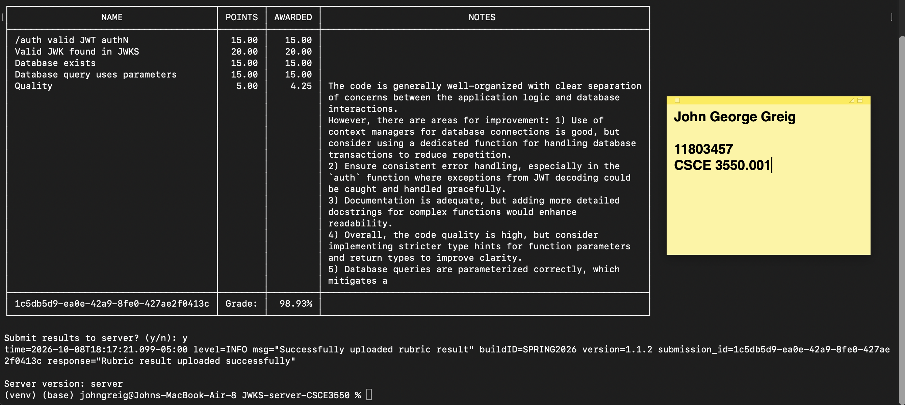

# SQLite JWKS & Mock Authentication Server

A Python/Flask server that persists 2048-bit RSA private keys in SQLite and issues
RS256 JWTs. This implements Project 2 of CSCE 3550.

## Setup and execution

Requires Python 3.10+. SQLite support is included in Python's standard library;
no separate SQLite server or Python package is needed.

```bash
python3 -m venv venv
source venv/bin/activate
pip install -r requirements.txt
python app.py
```

Run from the repository directory. The server listens on port 8080 and creates
`totally_not_my_privateKeys.db` in the **current working directory**. The blackbox
client must run from that same directory (or use matching directory/database
arguments).

## Persistent storage

`storage.py` creates the required schema:

```sql
CREATE TABLE IF NOT EXISTS keys(
    kid INTEGER PRIMARY KEY AUTOINCREMENT,
    key BLOB NOT NULL,
    exp INTEGER NOT NULL
);
```

Private keys are serialized as PKCS1 PEM bytes and stored as BLOBs. Expiration
is an integer Unix timestamp. Startup ensures there is at least one key expired
one hour ago and one active key expiring one hour later. Existing keys and IDs
are retained across restarts; no duplicate seed keys are added when both
categories already exist. If a category is missing during authentication, a new
key is saved and then read back from SQLite before signing.

All query values are passed as bound parameters, without string interpolation.
Connections are closed explicitly, and writes use transactions. JWT/JWK `kid`
values are strings containing the integer database ID.

The database contains unencrypted private keys, as required by this assignment.
It and its SQLite sidecars are excluded from Git. Keep the database file when
restarting or moving this mock server to preserve its signing keys.

## Endpoints

### `GET /.well-known/jwks.json`

Reads **all** keys with `exp > now` from SQLite and returns their public RSA
components in a JSON Web Key Set. Private PEM bytes never appear in the response.

### `POST /auth`

Reads an active private key and returns a raw signed JWT (`text/plain`). Claims
include `exp`, `iat`, `iss` (`jwks-server`), and `sub` (the supplied username, or
`user123` by default). Token expiration matches the stored key expiration.

The **presence** of the `expired` query parameter selects an expired key:
`/auth?expired`, `/auth?expired=true`, and `/auth?expired=false` all issue expired
JWTs. Expired keys are excluded from JWKS.

Both HTTP Basic auth and JSON `{ "username": "userABC", "password": "password123" }`
are accepted. Passwords are ignored: this is mock authentication, not credential
validation.

```bash
curl -X POST -u userABC:password123 http://localhost:8080/auth
curl -X POST -H 'Content-Type: application/json' \
  -d '{"username":"userABC","password":"password123"}' http://localhost:8080/auth
curl -X POST 'http://localhost:8080/auth?expired=true'
curl http://localhost:8080/.well-known/jwks.json
```

## Tests and lint

```bash
python -m pytest
ruff check .
ruff format --check .
```

Tests use isolated temporary databases and cover the schema, PEM storage,
restart persistence, public-JWKS signature verification, expired tokens,
expiry boundaries, missing-key renewal, multiple published keys, Basic/JSON
mock authentication, SQL injection input, and unsupported methods.
`pyproject.toml` enables line/branch coverage for both modules and enforces a
minimum of 81%, above the assignment's 80% requirement.

## Blackbox client

Download and extract the appropriate binary from the
[official releases](https://github.com/jh125486/CSCE3550/releases).
Release v1.1.2 spells the command `project-2` (rather than `project2`). From the
repository directory with the virtual environment active, run:

```bash
/path/to/gradebot project-2 --dir=. --run="python app.py"
```

The client starts the server itself; stop any existing server on port 8080 first.
The generated database stays in this directory so the client can inspect it.

## Layout

- `app.py`: application factory and HTTP endpoints.
- `storage.py`: schema initialization, parameterized queries, and key persistence.
- `tests/test_app.py`: automated regression tests.
- `requirements.txt`: runtime and development dependencies.
- `pyproject.toml`: pytest, coverage, and lint settings.
- `screenshot.png`: historical Project 1 grading evidence.

## Test results

The run scored **98.93%** and was successfully submitted to the
grading server. The screenshot includes the results table.


